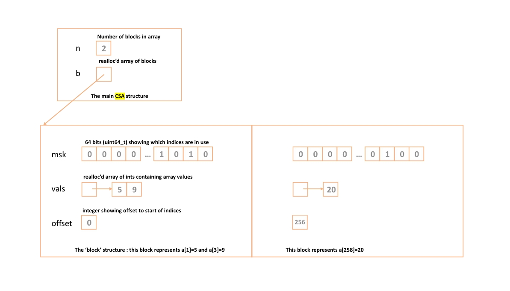

# Compressed Sparse Array (CSA)

A **Compressed Sparse Array (CSA)** implementation in C, is designed for arrays that are expected to be **very sparsely populated**. Instead of allocating memory for the entire array, it stores only the indices that are in use.

## How it works

The array is divided into blocks of 64 indices. Each block contains:

- A **64-bit bitmask** indicating which indices are occupied
- A dynamically allocated array containing the stored values, ordered by index
- An **offset** indicating which section of the overall array the block represents

For example, if values exist at indices `1` and `3`:

```text
Index:     0   1   2   3   4   5   ...  63
           │   │   │   │   │   │         │
Mask:      0   1   0   1   0   0   ...   0
               ↑       ↑
             used     used

Values:       [5]    [9]
```
The mask tells us where values exist, while the values array stores only those values. This avoids allocating space for all 64 positions when only a few are being used.

### Blocks

Each block represents 64 consecutive indices. So a value stored at index 130 belongs to the block with offset 128.
```
Block offset = 0    → indices 0–63
Block offset = 64   → indices 64–127
Block offset = 128  → indices 128–191
```




## Features

### Core ADT
- `csa_init()` - initialise an empty CSA
- `csa_set()` - store or update a value at an index
- `csa_get()` - retrieve a value and report whether the index is in use
- `csa_tostring()` - produce a string representation of the CSA
- `csa_free()` - free all allocated memory

### Extensions
- `csa_foreach()` - apply a user-defined function to every stored value using a function pointer
- `csa_delete()` - remove values and free blocks when they become empty

---

## Example

Storing values at indices 1, 3, 10, 23, and 62 uses a single block:
```text
Block offset: 0

Indices:   1    3    10    23    62
           │    │     │     │     │
Values:   [10] [30] [100]  [8]  [620]
```

Only five values need to be stored rather than allocating space for all 64 positions. The CSA representation is:

```1 block {5|[1]=10:[3]=30:[10]=100:[23]=8:[62]=620}```

## Memory Management

The implementation uses dynamic memory allocation throughout:
- `malloc()` for initial allocation
- `realloc()` when adding or removing values and blocks
- `free()` for memory cleanup

Blocks are created only when an index within that block is first used. When all values in a block are deleted, the block itself is freed. No linked lists or fixed-size block arrays are used.

## Testing

The implementation includes tests covering: Initialisation and empty CSAs, Insertion and overwriting, Multiple values within a block, Multiple blocks, Large indices, Missing values, Invalid inputs, `csa_foreach()`, Deletion and automatic block removal, Memory cleanup...

## Technologies

C · Dynamic Memory Allocation · Bit Manipulation · Function Pointers · ADT Design · Makefile

## Coursework

Developed as coursework for the University of Bristol MSc Computer Science programme, 2025.


